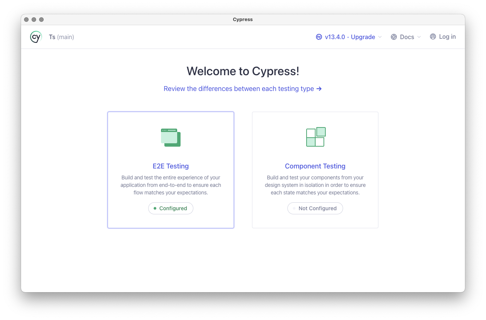
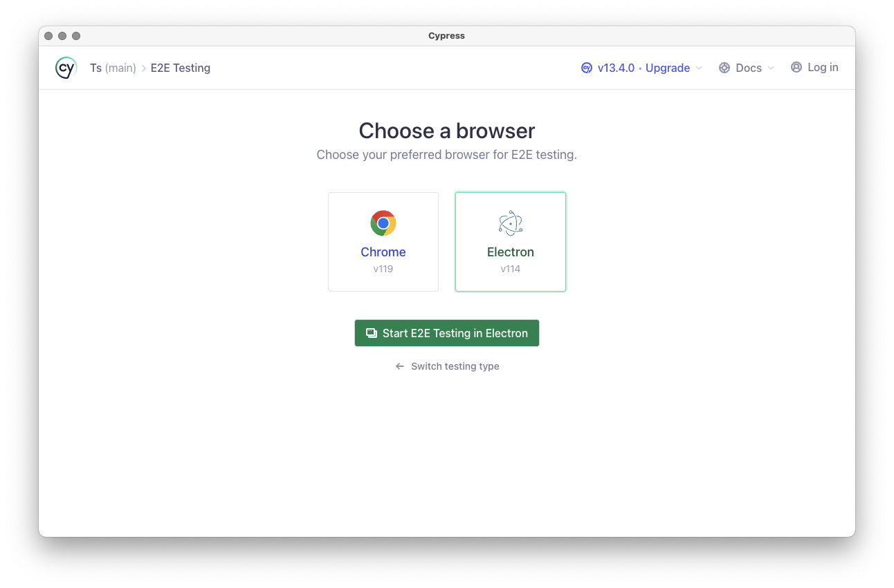
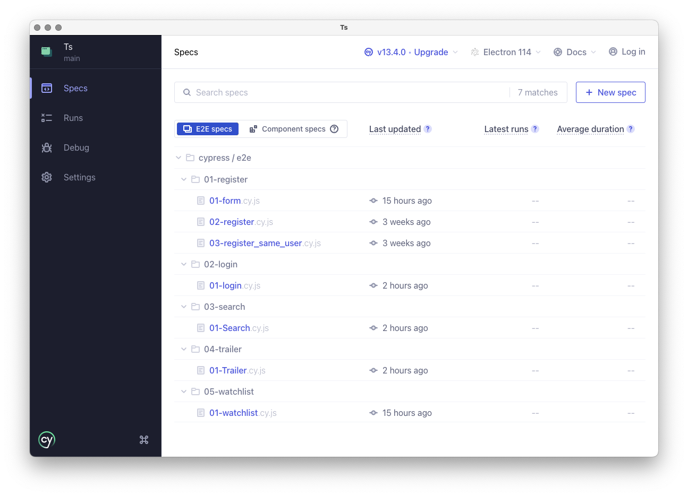

# Qualidade e Testes de Software

| Mestrado                               | Unidade curricular             | Data             |
| -------------------------------------- | ------------------------------ | ---------------- |
| **Mestrado em Engenharia Informática** | Qualidade e Testes de Software | Dezembro de 2023 |

## Grupo 2

| Nome         | Número de aluno |
| ------------ | --------------- |
| Carlos Silva | 26994           |
| Pedro Rocha  | 26898           |

## Como iniciar

Os testes documentados são executáveis em [**Cypress**](https://www.cypress.io/). Para os correr é necessário seguir alguns passos.

1. Instale as dependências necessárias com o comando `npm install`
2. Execute o **Cypress** com o comando `npx open cypress`

3. Selecione **E2E Testing** como tipo de testes

4. Selecione o _browser_ no qual será aberto o **Cypress**

## Executar os testes

Os testes estão organizados por prioridade por isso, é aconselhável corrê-los pela ordem númerica que é apresentada. Selecione na lista qual o teste que deseja correr, nomeadamente:

`cypress > e2e > 01-register > 01-form`

