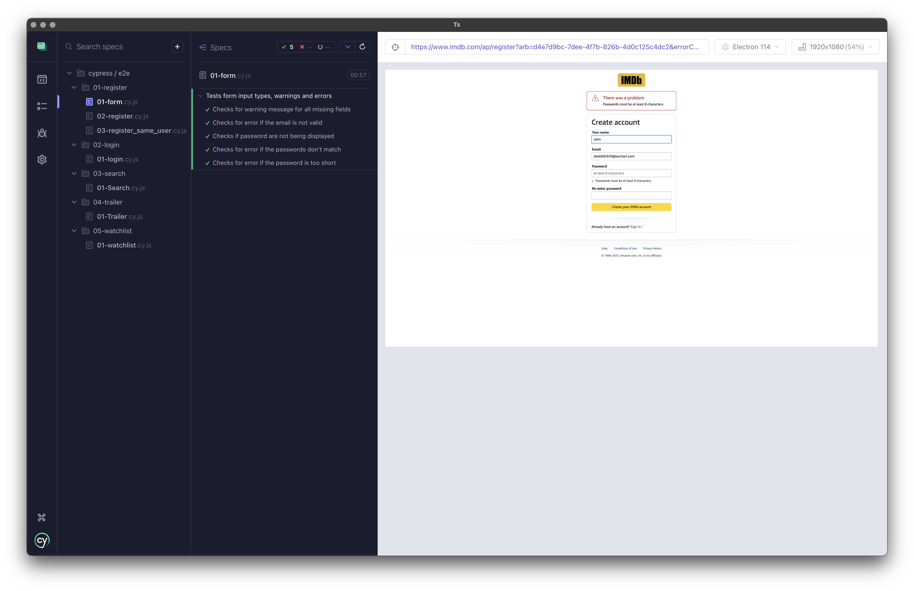

# Qualidade e Testes de Software

| Mestrado                               | Unidade curricular                 | Data             |
| -------------------------------------- | ---------------------------------- | ---------------- |
| **Mestrado em Engenharia Informática** | **Qualidade e Testes de Software** | Dezembro de 2023 |

Tabela de conteúdos:

- [Grupo de trabalho](#grupo-2)
- [Como iniciar](#como-iniciar)
- [Executar os testes](#executar-os-testes)
- [Antes de executar](#antes-de-executar)
  - [Estrutura e prioridade dos testes](#estrutura-e-prioridade-dos-testes)
  - [Correr automaticamente os testes](#correr-automaticamente-os-testes)

## Grupo de trabalho

Grupo 2:

| Nome         | Número de aluno |
| :----------- | --------------: |
| Carlos Silva |           26994 |
| Pedro Rocha  |           26898 |

## Como iniciar

Os testes documentados são executáveis em [**Cypress**](https://www.cypress.io/). Para os correr é necessário seguir alguns passos:

1. Instale as dependências necessárias com o este comando:

```
npm install
```

2. Execute o **Cypress** com o comando:

```
npx open cypress
```

3. Selecione **E2E Testing** como tipo de testes:


4. Selecione o _browser_ no qual será aberto o **Cypress**:


## Executar os testes

### Antes de executar

Altere as seguintes variáveis no ficheiro `Contants.js` na pasta `readme_docs`:

1. `EMAIL`: altere o endereço de email do utilizador dos testes. É necessário acesso a esta conta para poder confirmar a criação da conta;
2. `MANUAL_CHECK` (opcional): pode ser necessário fazer verificações manuais no decorrer dos testes, como um verificação de **_CAPTCHA_**. Atribua o valor `true` a esta variável.

> No desenvolvimento foram utilizadas contas de email temporárias [Temp Mail](https://temp-mail.org/) para efetuar os testes.

### Estrutura e prioridade dos testes

Os testes estão organizados por prioridade por isso é aconselhável corrê-los pela ordem númerica que é apresentada. Selecione na lista qual o primeiro teste que deseja correr, nomeadamente:

1. `cypress > e2e > 01-register > 01-form`


Deixe o teste correr, auxiliando no preenchimento de qualquer validação humana, se necessário. Ao finalizar, cada teste deverá ter um aspeto semelhante a este:



Siga este passo até ao último teste para obter todos os resultados.

### Correr automaticamente os testes

> Os testes do registo irão falhar por causa da validação. Outros poderão falhar também, caso o _website_ peça a validação de utilizador humano.

Para correr automaticamente os testes execute o seguinte comando:

```
npx cypress run
```

Serão apresentados os resultados de cada teste na console. Poderá ainda encontrar os vídeos dos testes na página `cypress > videos`.
